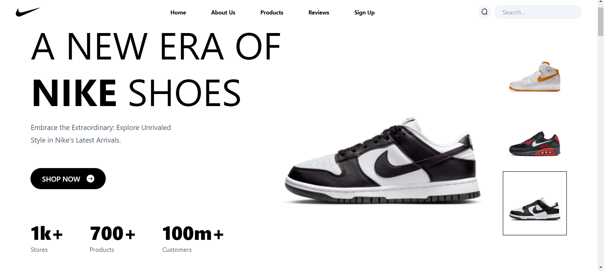
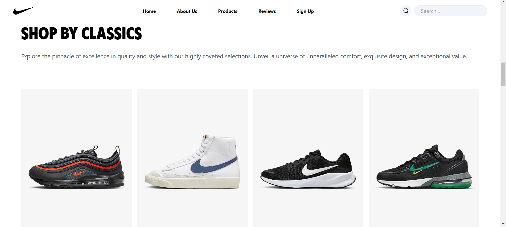
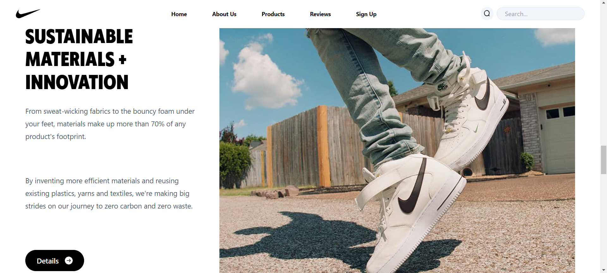
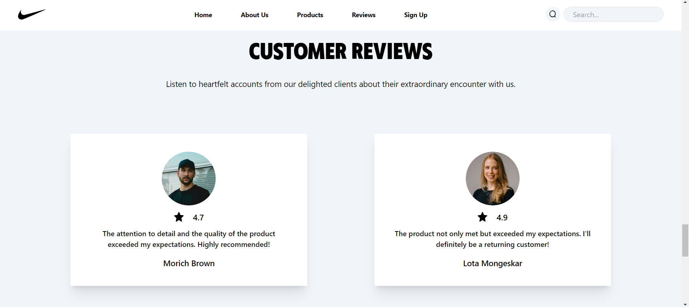

# Nike Landing Page

This repository contains the source code for a landing page heavily inspired by Nike's design. The landing page is built using HTML, CSS, and JavaScript.

# React + Vite + Tailwind

This project provides a minimal setup to get React working in Vite with HMR and some ESLint rules.

Currently, two official plugins are available:

- [@vitejs/plugin-react](https://github.com/vitejs/vite-plugin-react/blob/main/packages/plugin-react/README.md) uses [Babel](https://babeljs.io/) for Fast Refresh
- [@vitejs/plugin-react-swc](https://github.com/vitejs/vite-plugin-react-swc) uses [SWC](https://swc.rs/) for Fast Refresh

## Features
- **Responsive design:** The landing page is designed to be fully responsive and compatible with various screen sizes.
- **Interactive elements:** Utilizes JavaScript to create interactive features such as a dynamic shoe display and a navigation menu.
- **Modern UI:** Inspired by Nike's design language, the landing page offers a sleek and modern user interface booted with Tailwind CSS.

## Implementation

### Products Preview

### New This Week

### Products Quality

### Customer Reviews

